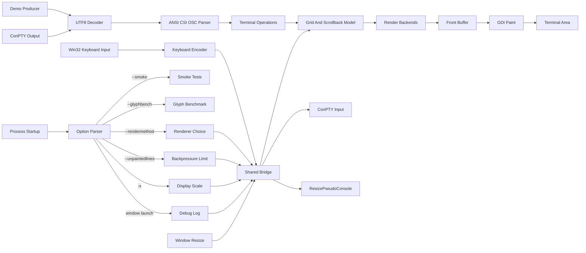

# Winxterm Architecture

This directory contains the native Windows port bring-up for XTerm for Windows. The current implementation includes Phase 1 bring-up, completed Phase 2 rendering/client scaffolding, and the Phase 3 terminal core: a generated bitmap-font header, multiple selectable text-rendering backends, a terminal-operation parser contract, a grid plus scrollback screen model, extended screen-layout semantics, xterm-style ANSI/CSI/OSC handling, keyboard encoding, demo and glyph benchmark modes, ConPTY hosted process support, and the external default `dstshell.exe` shell.

The historical upstream `xterm-410` import is not part of the public release tree. Full upstream terminal behavior is not ported yet.

## Build And Runtime Shape

`CMakeLists.txt` builds a `WIN32` executable named `winxterm` using C17 and the MSVC toolchain. It also builds a separate `pcf_to_header` converter tool. Normal builds compile the converter but do not run it.

- `user32` for window creation and message dispatch.
- `gdi32` for painting the bitmap-backed client area.
- `shell32` for command-line argument parsing.

The executable is a GUI subsystem application. Command-line maintenance paths, such as `--smoke` and `--glyphbench`, run before the window is created and return process exit codes directly. `--help` writes to an attached interactive console when available, otherwise it falls back to a dialog.

## Main Components

`src/main.c` owns process startup. It parses command-line options, dispatches `--smoke` and `--glyphbench`, initializes the disabled debug-log handle, initializes threaded runtime, and performs shutdown cleanup. It also handles console-vs-dialog help output.

`src/winxterm_app.c` owns the native Win32 window. It registers the window class, creates the main window, tracks resize/minimize/maximize/restore events, applies integer display scaling, propagates terminal cell-size changes through the bridge, toggles fullscreen with Alt+Enter, encodes keyboard messages through `src/winxterm_input.c`, handles close confirmation for a running direct ConPTY child, logs Alt+F4, renders posted screen updates into the backbuffer, swaps buffers, and paints the current front buffer into the client area.

`src/winxterm_render.c` owns Phase 2 bitmap operations and glyph drawing. It supports span rendering, AVX2 row-mask rendering with safe masked stores, an opaque pre-colored glyph cache keyed by glyph plus foreground/background color, and a shared fixed-cell TTF fallback blitter for codepoints outside the built-in bitmap atlas.

`src/winxterm_screen.c` owns the mutable terminal grid and scrollback model. It stores primary and alternate visible grids, row wrap metadata, cursor state, saved cursor state, current attributes, protected-cell metadata, tab stops, vertical and horizontal scroll margins, origin mode, auto-wrap and reverse-wrap behavior, alternate-screen variant semantics, DEC special graphics cell mapping, soft-wrapped scrollback reflow, fallback glyph mapping, and a 10,000-row scrollback cap.

`src/winxterm_terminal_ops.h` defines the parser-to-screen operation contract. Parser output is expressed as typed operations rather than direct screen mutation.

`src/winxterm_text.c` owns UTF-8 decoding plus ANSI/CSI/OSC parsing. It handles controls, cursor movement including absolute horizontal/vertical movement and line-oriented cursor controls, erase in display/line including selective erase, insert/delete character, column, and line operations, scroll up/down/left/right, scroll margins, origin mode, auto-wrap and reverse-wrap modes, tab set/clear, save/restore cursor, protected text controls, selected DEC rectangle operations, DEC special graphics charset selection, SGR reset plus 8/16/256/RGB colors, OSC title setting, fallback glyph operation output for unsupported Unicode, and unsupported-sequence skipping.

`src/winxterm_client.c` owns producer-side behavior: demo generation through the shared parser/screen API, ConPTY process launch delegation, and headless glyph benchmarking. The demo emits xterm-style SGR background changes every 10 visible characters and uses a no-wait scaffold write path for output stress testing.

`src/winxterm_host.c` owns the root ConPTY and the managed-job coordinator. Each managed interactive job has a separate ConPTY, kill-on-close Job Object, terminal session, transcript, incrementally committed 64 MiB output journal, and monitor thread. The coordinator alone routes keyboard input, terminal replies, and resize events to the foreground session. Background output is retained losslessly and backpressures its producer at the journal limit. Foreground switching swaps complete screen/decoder/title state and consumes retained output only after the bridge accepts it.

`src/winxterm_job_coordinator.*`, `src/winxterm_job_manager.*`, `src/winxterm_job_protocol.*`, `src/winxterm_job_plan.*`, and `src/winxterm_job_channel.*` define the bridge-owned coordinator surface, synchronized registry, and bounded inherited-pipe protocol used by `dstshell`. The coordinator publishes active-session identity and owns bounded FIFO native-command and View-completion queues. Protocol clients have independent reply locks, request namespaces, immutable paginated list snapshots, and ownership identities. A managed standalone `dstshell` receives a new channel and becomes the owner of jobs it creates, so nested shells are authorized only for themselves and their descendants. Channel loss does not tear down already managed processes.

`src/winxterm_job_dispatch.c` owns frame reading, request validation, TLV parsing, list pagination encoding, capabilities, and serialized replies. It treats the host runtime as opaque and invokes the narrow operations declared by `src/winxterm_host_dispatch.h`; process creation, signaling, session switching, and stream mutation remain host-runtime operations rather than protocol-parser responsibilities.

`src/winxterm_managed_runtime.*` defines the managed process/session record and synchronized runtime registry. `src/winxterm_host.c` implements the Windows-specific mechanics over that registry: ConPTY and kernel-pipe creation, Job Object assignment, process launch, output monitoring, connections, attachments, and bounded shutdown.

Session presentation is keyed by job ID. Screen, decoder, title, transcript, journal, and pending input live with the terminal session; switching atomically parks queued keyboard and terminal-reply bytes before changing the route. The window caches viewport, selection, and bell UX per published session ID and restores it before rendering the new screen, while transient pointer gestures are discarded because their coordinates refer to the old screen.

The host creates concurrent multi-stage pipelines from typed plans, including private isolated-builtin helper stages, kernel pipe edges, file endpoints, and final-stage exit status. Stream connections run in dedicated cancellable workers using the source journal as their lossless queue: bytes are consumed only after the destination accepts them. File attachment and normal close escalation are likewise cancellable without blocking the protocol reader.

`src/dstcmd/` owns the `dstshell.exe` runtime. `dstshell` is a separate executable target built with winxterm; when no explicit client executable is supplied, winxterm locates it beside `winxterm.exe` and launches it through the same ConPTY host path as `cmd.exe`, PowerShell, or bash. The shell consumes standard input/output handles supplied by ConPTY, maintains bash-like line editing and history state, echoes and parses complete lines, and delegates completed argv-style commands to a centralized builtin dispatch table or to the unified execution planner with the shell cwd as the child current directory. Builtin implementations live under `src/dstcmd/commands/`, while shell-facing shared contracts such as command signatures and cwd-relative path resolution live under `src/dstcmd/api/`.

`src/winxterm_input.c` owns keyboard input encoding. It converts printable characters, Alt printable prefixes, cursor/navigation keys, function keys, and modifier variants into terminal byte sequences for the host input queue.

`src/winxterm_bridge.c` owns shared state between the window thread and producer/client thread: the screen lock, selected renderer, unpainted-line backpressure, elastic host input queue, pending resize state and coalescing counters, direct-child host state, headless/terminate requests, terminal title, bell notification state, window update posting, and FPS/diagnostic counters.

`src/winxterm_log.c` owns opt-in debug-log path creation and timestamped log writes. Runtime logs are disabled by default; `set debuglog on` creates `%USERPROFILE%\.winxterm\logs\winxterm-debug-{PID}.txt`.

`src/winxterm_options.c` owns supported command-line options. Unknown options are rejected early. Renderer selection is controlled with `--rendermethod <spans|row-masks|precolored-cache|all>`, producer backpressure is controlled with `--unpaintedlines <count>`, and startup display scale is controlled with `-x <integer>`.

`src/winxterm_smoke.c` owns built-in self-tests. These tests validate non-UI invariants such as option parsing, render dimensions, generated font contracts, UTF-8/parser behavior, CSI/OSC operation handling, grid and alternate-screen behavior, bridge queue/backpressure/resize diagnostics, SGR color attributes, keyboard encoding, renderer equivalence, and opt-in debug-log behavior.

`src/winxterm_render.h` defines rendering constants and the public render backend contract: 80 columns, 24 rows, 6x13 cells, 480x312 initial logical bitmap size, 32-bit BGRA pixels, and default Phase 2 colors. `src/winxterm_scale.h` defines the bounded integer display scale helpers used by command-line parsing, window sizing, painting, and hit-testing.

`resources/winxterm_font_6x13.h` is generated from `resources/6x13-ISO8859-1.pcf`. It contains 256 ISO-8859-1 glyphs plus one internal missing-glyph fallback, stored as row masks and foreground/background spans. `generated/winxterm_font_6x13.h` remains as a compatibility include shim. Non-bitmap codepoints keep their Unicode values in the screen cell and are rasterized on demand from startup-loaded TTF fallback fonts when those resources are available.

## Data Flow

## Window And Buffer Model

The application keeps window/message handling separate from terminal state and producer-side output. `WinxtermApp` owns the native `HWND`, a debug-log pointer, two heap-allocated 32-bit pixel buffers, current bitmap dimensions, render cache state, and fullscreen restore state.

Rendering clears or updates the logical back buffer, draws the current visible terminal grid from the screen model, marks accepted producer output as painted, swaps buffers, and asks Win32 to repaint. At display scale 1, painting copies the front buffer to the window with the existing 1:1 `StretchDIBits` path. At larger integer scales, painting stretches the logical bitmap to `bitmap_width * scale` by `bitmap_height * scale`; resize and hit-testing divide physical client pixels by that same scale before calculating terminal rows and columns.

## Runtime Options

`--rendermethod` chooses the active renderer. Normal mode and `--demo` use the selected backend, defaulting to the profiled `row-masks` renderer. `--demo` cycles all backends only when `--rendermethod all` is set. `--glyphbench` runs either the selected backend or all backends.

`--unpaintedlines` sets the accepted-but-unpainted producer line budget. Hosted ConPTY output blocks before parser/screen acceptance when this budget is reached, preserving terminal correctness while allowing the child to block naturally through ConPTY pipes. The demo intentionally bypasses this wait so it can stress the rendering path with output faster than painting.

`-x <integer>` sets the startup display scale from 1 through 100, defaulting to 1. `dstshell` also supports `set scale N` at runtime by emitting the public winxterm OSC control protocol. Runtime scale requests are posted through the bridge to the window thread, preserve a scrolled viewport anchor where possible, resize the window in normal windowed mode, and recompute capacity in maximized or fullscreen mode.

The first non-option argument is treated as the client only when it resolves to a Windows executable. Remaining positional arguments are passed to that client. If no client command is supplied, winxterm starts `dstshell.exe` from its own directory through the generic ConPTY process host. If a positional client is supplied but cannot be resolved as an executable, winxterm starts `dstshell.exe` with a visible diagnostic. If `dstshell.exe` is missing, startup reports the problem and fails cleanly.

When the window closes, winxterm shows every live managed job except the root shell in a scrolling confirmation control. If only the shell is running, closing the window closes it without prompting. `Keep running` is unchecked by default; selecting it leaves managed jobs and their sessions alive headlessly while the root shell is closed, and output remains journaled and backpressured. Choosing termination applies Ctrl+C followed by the 300 ms Job Object escalation policy to each live job tree. The coordinator remains alive after the root client exits while managed children still exist.

`dstshell` keeps its own current directory and directory stack rather than mutating the process cwd. Builtins resolve paths against that shell cwd. The normal environment variable `CWD` tracks the shell cwd, `pwd` prints `CWD`, and `set CWD save|clear` writes or removes only `CWD` in `.winxterm/env.rc`. Command modules currently provide `ls`, `cd`, `pushd`, `popd`, `pwd`, `cp`, `mv`, `rm`, `echo`, `export`, `set`, `playmacro`, and `exit`; `ls` supports `-ltha` and defaults to wide columns unless a list-style option such as `-l` or `-t` is active. `export VARNAME=value` mutates the process environment inherited by later children, and `export` without arguments lists environment entries. `./name` resolves only from the shell cwd, while bare commands search the inherited `PATH`; `.ps1`, `.cmd`/`.bat`, `.sh`, or hashbang scripts are mapped to PowerShell, `cmd.exe`, or `bash.exe` when available.

Completed `dstshell` command lines are split into groups separated by `;` and `&&`; adjacent `|` segments become one typed managed execution plan. With a negotiated channel, dstshell resolves argv, aliases, cwd, environment, endpoints, and isolated builtins but Winxterm creates all external processes, ConPTYs, Job Objects, and pipe edges. Pipeline stages start before any wait, final-stage status drives `&&`, and stateful parent builtins remain in the requesting shell. Direct `CreateProcess` and legacy stdio pipeline paths exist only as the no-channel compatibility fallback.

The final stage of a pipeline group can redirect client stdout with `>` or `>>`, creating/truncating or creating/appending the target file. Prefixing the redirect token with `t` (`t>` or `t>>`) tees those same stdout bytes through to terminal stdout while still writing the file. Stderr and shell diagnostics are not redirected. After a successful file redirect, `dstshell` reports the bytes written, elapsed time, and throughput on terminal stdout.

Interactive `dstshell` input supports Left/Right/Home/End/Delete, Ctrl+A/E/B/F/D/K/U/W, Up/Down history navigation, Ctrl+R history search, Tab completion for builtins, filesystem paths, and `PATH` commands, and Ctrl+L clear-screen. Ctrl+R opens a compact dark-blue overlay of at most five lines below the current command line, seeds the search query from the current command line, captures immediate typeahead, filters session plus saved history, lets Up/Down or Ctrl+P/N move the selection, toggles best/recent order with Ctrl+R, toggles fuzzy/contains matching with Alt+R, accepts the selected command into the prompt with Enter without executing it, and restores the original prompt line with Ctrl+C, Esc, or Ctrl+G. The overlay clears its owned rows and restores terminal attributes on exit. The parser expands simple `$VARNAME` references in unquoted and double-quoted arguments before dispatch, while single quotes preserve the literal text. Startup loads `.winxterm/env.rc`; if that file supplies a valid `CWD`, dstshell starts there, otherwise it keeps the process starting directory and sets `CWD` to that value. Invalid saved `CWD` values produce a note rather than a startup failure. History is stored in `.winxterm/history.sqlite3` below the Windows home directory (`USERPROFILE`, with `HOMEDRIVE`/`HOMEPATH` fallback), while the current process also keeps an in-memory session history for instant navigation and search. `set debuglog on|off`, `set scale`, and `playmacro` emit `OSC 9001 ; winxterm ; v=1 ; id=<n> ; cmd=<verb> ; ... ST` and wait for a matching host acknowledgement.

The visible cursor is rendered as an xterm-style blinking block at the screen cursor row and column. The screen model stores cursor visibility and cursor style state; the current renderer still draws a block cursor and suppresses it when `?25` hides the cursor. The window uses `GetCaretBlinkTime()` for the blink interval when Windows exposes a usable value, otherwise it falls back to 500 ms.

## Assets

`resources/winxterm.rc` embeds `resources/winxterm.ico` into the executable. The icon is generated from the project-owned icon PNG.

The same resource script embeds three fixed startup TTF fallbacks as `RCDATA`: a general Unicode font, an emoji font, and a math-symbol font. `src/winxterm_glyph_fallback.cpp` loads those resources into DirectWrite font faces, rasterizes missing bitmap glyphs into 6x13 or 12x13 fixed-cell alpha tiles, caches them with an LRU cap, and lets every renderer backend blit the same cached pixels.

The bitmap font source lives at `resources/6x13-ISO8859-1.pcf`. `tools/pcf_to_header.c` converts it into `resources/winxterm_font_6x13.h` when run manually.

## Phase 2 Completion Check

The Phase 2 implementation is present in this public tree:

- The fixed 6x13 bitmap font is generated into a checked-in C header.
- BGRA32 front/back buffers, clears, swaps, scroll primitives, and glyph blitting are implemented.
- Span, AVX2 row-mask, and pre-colored-cache renderers are implemented and selectable.
- Per-cell foreground/background color attributes are supported, including minimal SGR parsing.
- Demo, benchmark, smoke, renderer selection, and output-only client scaffold paths are implemented.
- Screen/history state now tracks visible grid cells plus a fixed 10,000-row scrollback cap.

## Phase 3 Completion Check

The Phase 3 implementation is present in this public tree:

- Parser output is a typed terminal-operation stream consumed by the screen model.
- The screen model is a primary/alternate grid with scrollback, cursor state, attributes, protected-cell metadata, tab stops, vertical and horizontal scroll margins, origin mode, auto-wrap and reverse-wrap modes, saved cursor state, distinct `?47`/`?1047`/`?1048`/`?1049` handling, soft-wrap metadata, and resize handling with scrollback reflow.
- ANSI/CSI/OSC handling covers the Phase 3 baseline plus screen-layout extensions: cursor movement, erases and selective erases, insert/delete cells, columns, and lines, scroll up/down/left/right, margins, modes, save/restore cursor, protected text, selected DEC rectangles, DEC special graphics cell mapping, SGR reset plus 8/16/256/RGB colors, OSC title, winxterm OSC 9001 host-control requests, bell, and unsupported-sequence skipping.
- Hosted commands run through ConPTY with bidirectional output/input and resize propagation.
- Win32 keyboard messages are encoded into terminal input bytes and queued through the bridge.
- Smoke tests cover parser fixtures, screen-operation invariants, screen-layout edge cases, resize scrollback reflow, renderer equivalence, and keyboard encoding.

## Remaining Extension Points

Later terminal behavior remains behind explicit APIs:

- Scrollback navigation, selection, clipboard, paste, and mouse behavior belong in Phase 4 UX work.
- Wide and combining character rendering can expand the existing width metadata in the terminal cell contract.
- Cursor style rendering, full DEC rectangle attribute coverage, and exact xterm resize viewport behavior remain compatibility extension points beyond the current block-cursor and primary-scrollback reflow implementation.
- Diagnostics and compatibility stress tests belong in Phase 5 hardening.
- Dynamic runtime font switching remains out of scope. The renderer uses the generated 6x13 bitmap font first and the fixed bundled startup TTF fallbacks only when a cell's codepoint is not covered by the bitmap atlas.
